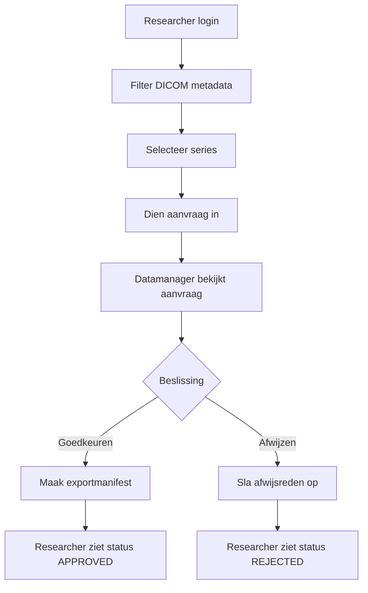

# Voorbeeld Diagram-Review

Dit voorbeeld is een demo-run/simulatie van de test-agent. Het toont dat de test-agent diagrammen kan beoordelen op basis van acceptatiecriteria.

## Input

User story:
Als onderzoeker wil ik een selectie-aanvraag kunnen indienen, zodat een datamanager de aanvraag kan beoordelen voordat data beschikbaar komt.

Acceptatiecriteria:
1. De onderzoeker kan DICOM metadata filteren.
2. De onderzoeker kan resultaten selecteren.
3. De onderzoeker kan een aanvraag indienen.
4. De datamanager kan de aanvraag goedkeuren of afwijzen.
5. Bij goedkeuring wordt een exportmanifest klaargezet.

Producttype:
Diagram

Opgeleverd product:

## Output van test-agent

## Eindoordeel
Status: Goedgekeurd met opmerkingen

Korte onderbouwing:
Het diagram toont de hoofdflow van researcher tot datamanagerbeslissing en exportmanifest. De kern van de acceptatiecriteria is zichtbaar. Het diagram mist nog foutpaden, zoals geen resultaten, lege selectie en afwijzen zonder reden.

## Controle per acceptatiecriterium
- AC1: Gehaald
  Uitleg: De stap `Filter DICOM metadata` is opgenomen.
- AC2: Gehaald
  Uitleg: De stap `Selecteer series` is opgenomen.
- AC3: Gehaald
  Uitleg: De stap `Dien aanvraag in` is opgenomen.
- AC4: Gehaald
  Uitleg: De datamanagerbeslissing met goedkeuren en afwijzen is opgenomen.
- AC5: Gehaald
  Uitleg: Bij goedkeuren volgt `Maak exportmanifest`.

## Gevonden problemen
- Probleem: Geen foutpad voor afwijzen zonder reden.
  Impact: Een belangrijke businessregel kan in implementatie of test vergeten worden.
  Bewijs of locatie: De afwijsflow gaat direct naar `Sla afwijsreden op`.
- Probleem: Geen pad voor lege selectie of geen queryresultaten.
  Impact: De UI- en API-validatie voor deze situaties is niet zichtbaar.
  Bewijs of locatie: Het diagram start vanuit een succesvolle filter- en selectieflow.

## Risico's
- Risico: Het diagram suggereert dat exportmanifest direct na approval altijd lukt.
  Waarom dit relevant is: In werkelijkheid kan exportvoorbereiding falen door Orthanc, opslag of bestandsrechten.

## Verbetervoorstellen
- Voorstel: Voeg een foutpad toe voor `Afwijzen zonder reden`.
  Verwacht effect: Maakt duidelijk dat een afwijsreden verplicht is.
- Voorstel: Voeg een exportstatus toe: `PENDING`, `READY` of `FAILED`.
  Verwacht effect: Het diagram sluit beter aan bij de werkelijke backendstatus.
- Voorstel: Voeg een pad toe voor `Geen selectie`.
  Verwacht effect: Maakt validatie aan de researcher-kant zichtbaar.

## Advies voor het team
Gebruik dit diagram voor de hoofdflow, maar breid het uit met validatie- en foutpaden voordat het als definitief ontwerp geldt.
